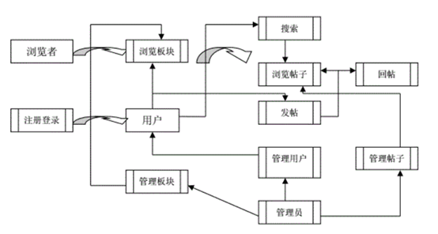
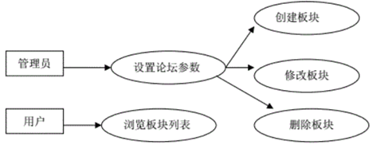
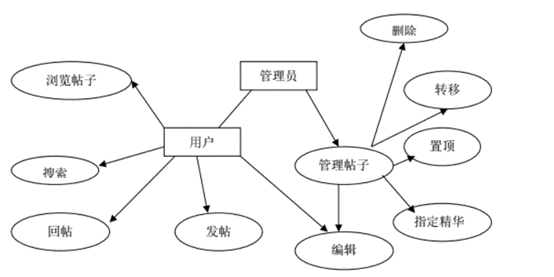

# Go
Software Engineering Project

> 用户分析文档放在下面

## 围棋论坛

**需求分析文档**

v1.0

第29组：尹晓辉、周帆杰、韩文康

- 修订记录

| 版本号 | 日期      | 修订人 | 修订章节和内容 |
| ------ | --------- | ------ | -------------- |
| v1.0   | 2020.4.28 | 周帆杰 | 提交基本代码   |
|        |           |        |                |
|        |           |        |                |

## 目录

[围棋论坛](#围棋论坛)

[1.1 问题描述](#11-问题描述)

[1.2 系统概述](#12-系统概述)

[1.3 系统概述](#13-系统概述)

[1.4 参考资料](#14-参考资料)

[1.5 术语和缩略语](#15-术语和缩略语)

[2. 功能需求](#2-功能需求)

[3. 非功能需求](#3-非功能需求)

[3.1 系统运行环境](#31-系统运行环境)

[3.2 用户界面需求](#32-用户界面需求)

[3.3 性能需求](#33-性能需求)

[3.4 安全性](#34-安全性)

[3.5 可靠性](#35-可靠性)

[3.6 其他需求](#36-其他需求)

## method

## 1.1 问题描述

该项目为围棋论坛。集发帖，交友，评论等多种功能于一体，实现管理人员与用户的两种身份对网站的同时操作。

### 1.2 系统概述

本软件工程的项目为围棋论坛网站，为广大围棋爱好者们提供一个交流围棋的平台，每一位注册该网站的棋友可以在该网站发表博客，可以在该网站上实时观看最近热门动态，可以浏览他人博客并点赞，紧密拉进棋友们之间的联系。

### 1.3 系统概述

本软件工程的项目为围棋论坛网站，为广大围棋爱好者们提供一个交流围棋的平台，每一位注册该网站的棋友可以在该网站发表博客，可以在该网站上实时观看最近热门动态，可以浏览他人博客并点赞，紧密拉进棋友们之间的联系。

### 1.4 参考资料

百度贴吧-围棋吧

### 1.5 术语和缩略语

| 术语 | 名词解释 |
| ---- | -------- |
|      |          |
|      |          |
|      |          |
|      |          |

## 2. 功能需求

板块类有浏览列表和管理两个方法。

管理方法可以分为创建,修改和删除3个方法。

帖子类有浏览，发帖，回帖，搜索和管理5个方法，浏览方法可以分为列表和查看2个子方法，管理方法可以分为编辑，删除，置顶，转移，指定精华5个子方法，如下图。

## 3. 非功能需求

### 3.1 系统运行环境

Windows环境下的idea和eclipse开发

### 3.2 用户界面需求

要求，需要有计时器，现在围棋正在进行的阶段也提示出来。并提供中断比赛，停一手和认输的选项。对于对弈的角色既可以选择人，也可以选电脑。

### 3.3 性能需求

支持的终端数:20+

支持并行操作的用户数:50+

系统响应时间:20秒

峰值请求数:100次请求每秒

### 3.4 安全性

管理人员有权利封禁用户的账号与解封，阻止非法用户恶意发帖，该网站有用户举报功能，随时向管理人员提供举报信息，经审核后采取相应措施。数据在数据库中有严格的数据类型限定及主键的设定，避免唯一数据重复。

### 3.5 可靠性

响应时间：20秒内。

并发用户数：未知上限（50+） 

吞吐量：每秒可接受50以上页面请求。

### 3.6 其他需求

暂无